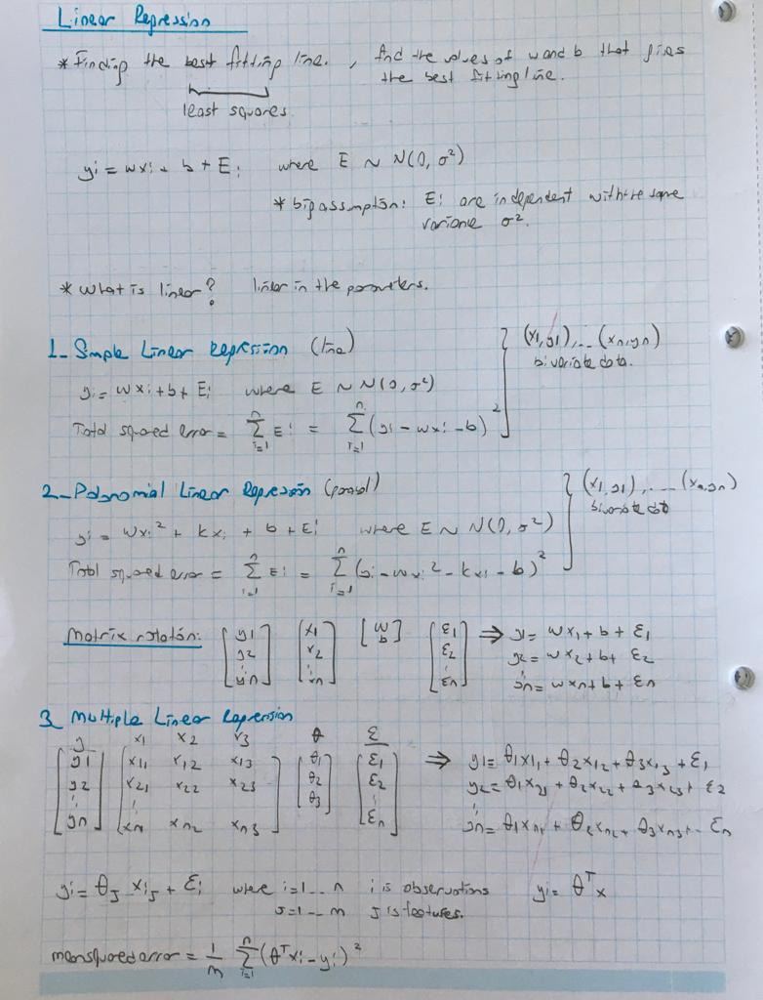
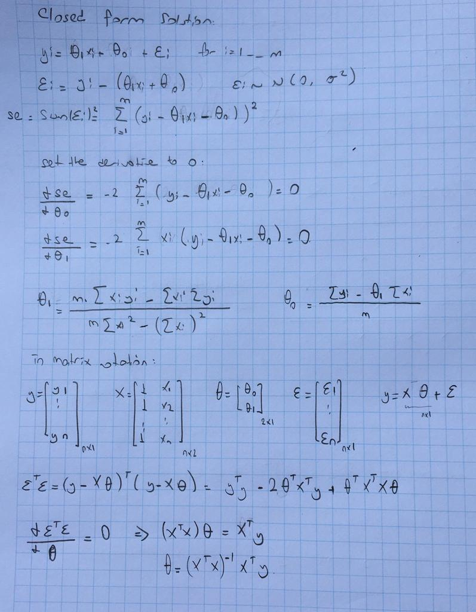

# Linear Regression

Read more: https://github.com/pelinbalci/machinelearning/blob/master/Notes/1_Introduction.md

Please see the lin_reg_example.xlsx to see basic calculations. 

Our aim is to find &theta; which minimizes mean squared error or root mean squared error. 

## Error Function

    Mean Squared Error = MSE = 1/N ∑ (y - pred(X))^2 for X, y ∈ D
    
    Root Mean Squared Error = RMSE = sqrt(MSE)
    
    Residual error is the error of each data point; (y_i - y_pred_i)

### Why don't we use absolute value of the errors?
Since if we use ∑ |y - pred(X)| we can end up with multiple lines that minimize this error. 

### Problem with squared
One data set has 10 point, the other has 100 points. As you add more data ∑ (y - pred(X))^2 will gets bigger. It can be hard for us to compare the results.
That's why we use mean squared error. Another solution is using adjusted R^2

### What is R^2? 
R^2 answers : How much of change in y is explained by x?

The formula is: 

    R^2 =  1 - (∑ (y - pred(X))^2  /  ∑ (y - y_mean))^2)

- R^2 tends to be high. 
- Overfitting produces a hig value of R^2
- Sensitive to outliers. 
- It also increases as you add more data. 
- It can't be used for nonlinear regression.
- It quantifies the strength of a linear relationship. 

    Adjusted R^2 = 1 - [(1-R^2) * (n-1) / (n-p-1) ]  where n = total sample size, p is number of predictors. 

**********
https://classroom.udacity.com/courses/ud120/lessons/2301748537/concepts/24511185440923

Note that R2 is only bounded from below by 0 when evaluating a linear regression on its training set. 
If evaluated on a significantly different set, where the predictions of a regressor are worse than simply guessing 
the mean value for the whole set, the calculation of R2 can be negative.
**********

## Error Function Cont'

The plots of LOSS vs WEIGHTS is always CONVEX`. It has one minimum.
Regression problems yield a convex `loss vs weight plot.

The error function can not be discrete, it should be continuous. 
If this was discrete, then we couldn't understand the direction of the gradient. 
Error function needs to be differentiable.💛 

💛 There are two solutions for finding &theta; that minimizes the mean squared error.

## Closed form solution
Set the derivative of mean squared error with respect to &theta; to 0. Below the solution is given for simple linear regression:

    python: theta = np.linalg.inv(X_b.T.dot(X_b)).dot(X_b.T).dot(y) where X_b is concatenate form of 1s and X values. 

## Gradient descent solution 
- Start with an initial guess for &theta;. We are at a random point in loss function. 
- Keep simultaneously changing them a little bit until CONVERGENCE💛  is achieved. 
- Iterate until overall loss stops changing at least changes extremely slow. When that happens THE MODEL HAS CONVERGED.

    - Batch Gradient:
        - Start with random weights.
        - In each iteration:
        - Take all the data.
        - calculate gradient by using all data.
        - Update weights with the opposite direction of the gradient. weight_new = weight - learning_rate * gradient. 
        If gradient is positive then you will decrease the weights, o.w you will increase the weights. 
            
    - Stochastic Gradient:
        - Start with random weights.
        - In each epoch:
            - In each iteration (len of data times)
            - Take one random data point.
            - calculate gradient by using this data.
            - Update weights with the opposite direction of the gradient.
       
       
I've used both batch and stochastic gradient descent in [lin_reg_solution.py](lin_reg_solution.py) I've used the same initial weights. 

Batch gradient: 10 iterations, full data is used in each iteration. 
Stochastic gradient: 10 epochs, only 10 out of 100 data is used to calculate gradients, i.e. 10 iterations in each epoch. 

Final iteration of batch:

    iter 9 ... theta 0: 3.526 theta 1: 3.833, gradient: -0.42  0.18, mse: 0.36, r^2: 0.885, mse_test: 0.11, r^2_test: 0.881
    Duration of batch gradient descent 0.8784499168395996

Final iteration of stochastic:

    iter 0 ... theta 0: 3.743 theta 1: 3.596, gradient: -0.05  -0.09
    iter 1 ... theta 0: 3.734 theta 1: 3.585, gradient: 0.09  0.11
    iter 2 ... theta 0: 3.735 theta 1: 3.587, gradient: -0.01  -0.01
    iter 3 ... theta 0: 3.745 theta 1: 3.594, gradient: -0.09  -0.07
    iter 4 ... theta 0: 3.749 theta 1: 3.598, gradient: -0.04  -0.04
    iter 5 ... theta 0: 3.753 theta 1: 3.606, gradient: -0.05  -0.08
    iter 6 ... theta 0: 3.754 theta 1: 3.607, gradient: -0.0  -0.0
    iter 7 ... theta 0: 3.758 theta 1: 3.614, gradient: -0.05  -0.07
    iter 8 ... theta 0: 3.75 theta 1: 3.597, gradient: 0.09  0.17
    iter 9 ... theta 0: 3.754 theta 1: 3.601, gradient: -0.04  -0.04
    epoch 9 ... theta 0: 3.754 theta 1: 3.601, gradient: -0.04  -0.04, mse: 2.438, r^2: 0.922, mse_test: 0.724, r^2_test: 0.921
    Duration of stochastic gradient descent 2.6927437782287598
    
    
TODO: Calculate the complexity of each  solution.

# Outlier

Train the data. 
Remove the points with largest residual error- outliers. 
Retrain the data. 
