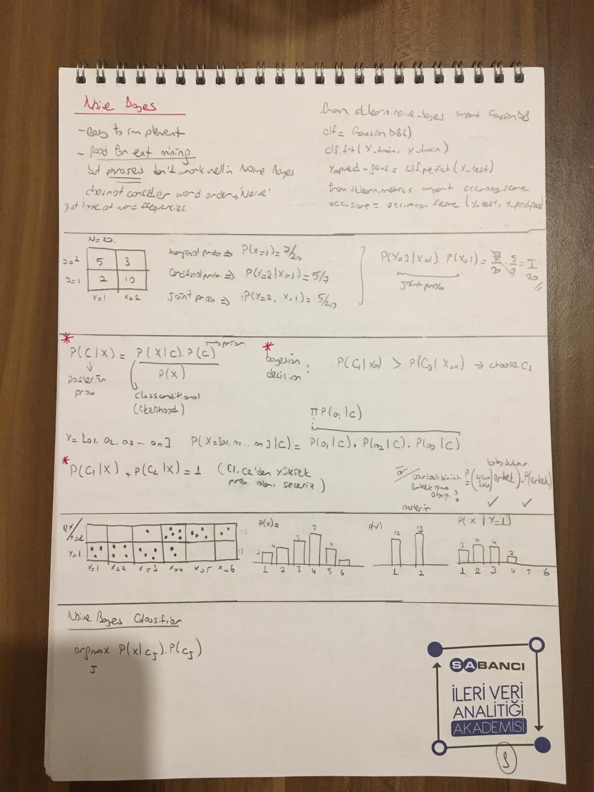
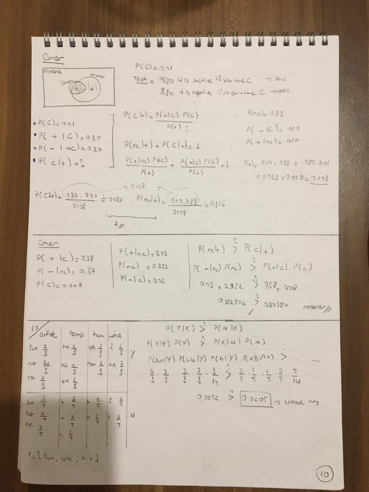
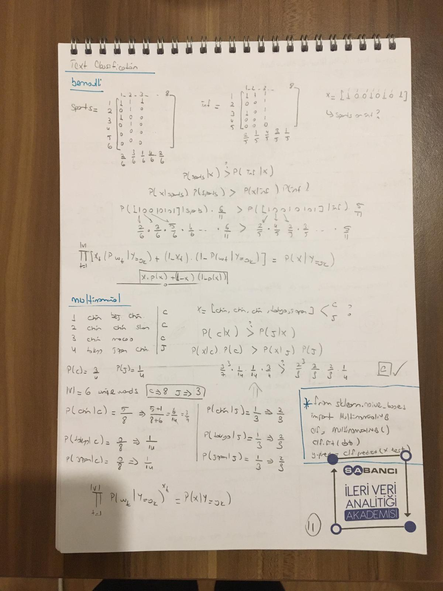

Code ref:
https://classroom.udacity.com/courses/ud120/lessons/2254358555/concepts/24196685390923

Ref: An Introduction to Machine Learning Second Edition, Miroslav Kubat

# Bayes

Bayesian Approach:

class1 (rich) = 9
class2 (poor) = 11

feature1 (has iphone)= 12
features2 (no iphone) = 8

|           | class1 -rich  | class2 - poor |
|---        |---            |---            |
| iphone    | 6             | 6             |  
| no iphone | 3             | 5             | 

    P(iphone) = 12/20
    P(rich) = 9/20
    P(rich | iphone) = 6/12
    P(iphone | rich) = 6/9
    
    P(iphone, rich) = P(iphone | rich)  * P(rich)
                    = 6/9 * 9/20
                    
    P(rich, iphone) = P(rich | iphone)  * P(iphone)
                    = 6/12 * 12/20
                    
    both equal. 
    
    Bayes formula comes from the equality of joint probabilities.

# Naive Bayes

Calculate for each class the probability of the given data. Choose the class with the highest value:

P(class1 | data) = P(data|class1) * P(class1)  /  P(data)
P(class2 | data) = P(data|class2) * P(class2)  /  P(data)

if P(class1 | data) > P(class2 | data) --> select class1
 
    
- Let's say our features: x = (x1, x2, x3, x4, ..., xn)

- Our aim is to find P(cj|x). --> P(x|cj) * P(cj)

- Don't forget: P(c1|x) + P(c2|x) = 1

- P(x|cj) is the probability that a randomly selected representative of class ci is described by vector x.

- P(xi|cj)  is the  probability that the value of the i-th attribute of an example from class cj. 

- Here we assume that (to be Naive) the attributes are mutually independent. Then we can calculate:

    - P(x|cj) = &pi; from(i=1 to n) P(xi | cj)
    - P(x|cj) = P(x1 | cj) * P(x2 | cj) * .. * P(xn | cj)
    - P(cj|x) = P(x1 | cj) * P(x2 | cj) * .. * P(xn | cj) * p(cj)

argmax j: P(x | cj) * P(cj)

Example:

I need to decide wheter or not going outside. 
I go outside 9 times and not go outside 5 times based on air conditions. 

I categorized it into 4 groups: outlook, temperature, humidity and wind. 

Today is : [sunny, cold, high humid, wind]. What should I do?

|           | Go outside = Y  |  Stay home = N|
|---        |----           |---       |
| sunny     | 2             | 3        |  
| over      | 2             | 0        |
| over      | 3             | 2        | 
|---        |---            |---       |
| hot       | 2             | 2        |  
| mid       | 4             | 2        |
| cold      | 3             | 1        | 
|---        |---            |---       |
|high humid | 3             | 4        |  
|low humid  | 6             | 1        |
|---        |---            |--        |
| wind      | 3             | 2        |  
| no wind   | 6             | 3        |
|---        |---            |---       |
                    

    P(Y | x) <? P(N| x)
    
    P(X|Y) * P(Y) <? P(X|N) * P(N)
    
    P(x1|Y) * P(x2|Y) * P(x3|Y) * P(x4|Y) * P(Y) = 2/9 * 3/9 * 3/9 * 3/9 * 9/14 = 0.0052
    
    P(x1|N) * P(x2|N) * P(x3|N) * P(x4|N) * P(N) = 3/5 * 1/5 * 4/5 * 3/5 * 5/14 = 0.0205

We choose Stay at home under these conditions. 

# Evaluation

Confusion Matrix:

|   | actual = 1  | actual = 0  |
|---|---|---|
| pred = 1  | TP | FP  |  
| pred = 0 | FN  | TN | 

Do not memorize those! 
is the pred correct (T or F) &  prediction (P (1) or N (0))

        Accuracy = TP + TN / TP + TN + FP + FN
        
        Recall = Sensitivity = TP Rate = TP / TP + FN
        
        Specificity = TN / TN + FP
        
        Precision  = TP / TP + FP
        
ROC & AUC is the curve of TP Rate vs FP rate.

⭐️ TP Rate = Recall = Sens =  TP / TP + FN --> actual is positive

⭐️ FP Rate = 1- Specificity = FP / FP + TN ---> actual is negative

# Example

C= Cancer
NC = No cancer

- P(C) = 0.01
- P(positive | C) = 0.90  ---> Sensitivity TP / TP + FN
- P(negative | NC) = 0.90 ---> Specificity TN / TN + FP

- P(negative | C) = 0.1
- P(positive | NC) = 0.1

If the test positive what is the probability of having cancer?
P(C| positive) = ? 

    P(C| positive) = P(positive|C) * P(C) / P(positive)
    
    P(positive) = P(C | positive)  + P(NC | positive)
                = P(positive|C) * P(C) + P(positive|NC) * P(NC)
                
    P(C| positive) = (P(positive|C) * P(C)) / (P(positive|C) * P(C) + P(positive|NC) * P(NC))
                   = (0.9 * 0.01) / (0.9*0.01 + 0.1*0.99)
                   = 0.0803
                   
                   
Or you can compare the classes:

    P( C| positive) <? P(NC | positive)

    P(positive|C) * P(C) <? P(positive|NC) * P(NC)
    
    0.9 * 0.01 <? 0.1 * 0.99
    0.009 < 0.099
    
    Select NC =)
    
    
    If you summarize them and divide each you can find the actual prob. 

# Summary

