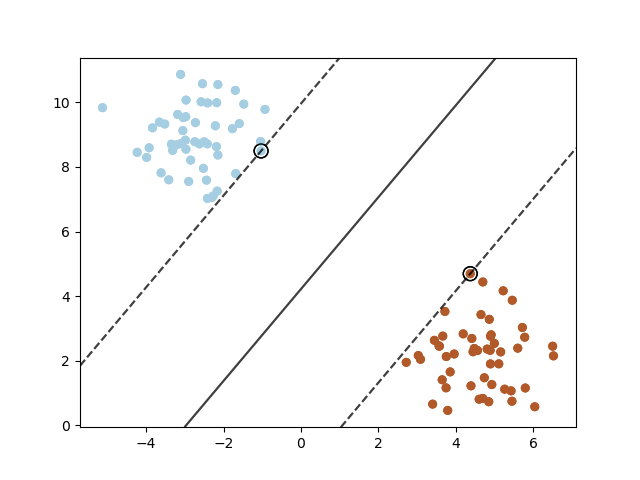
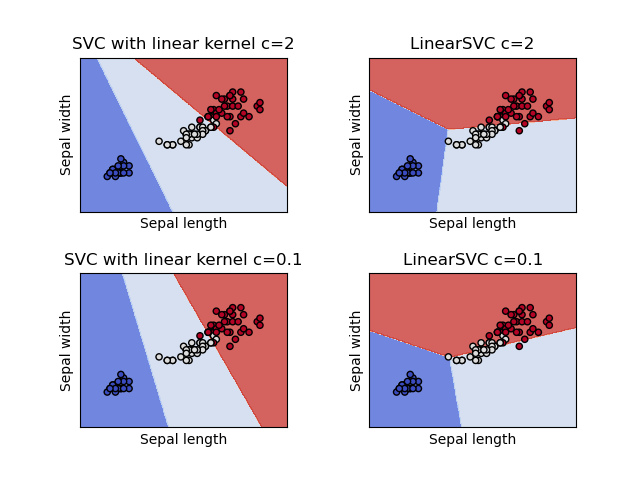
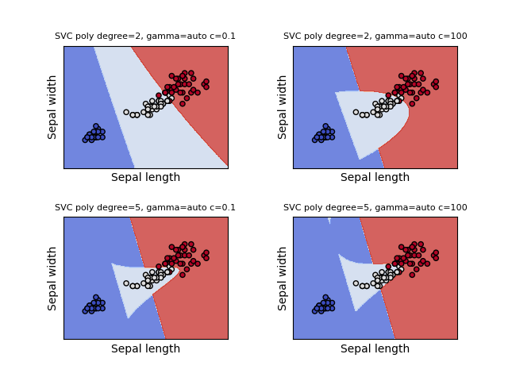
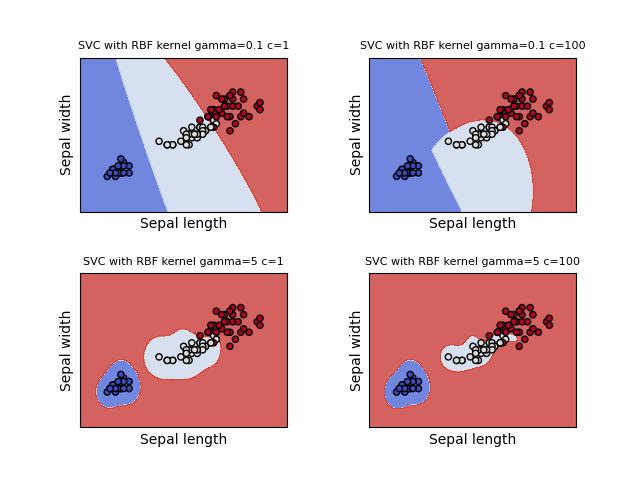
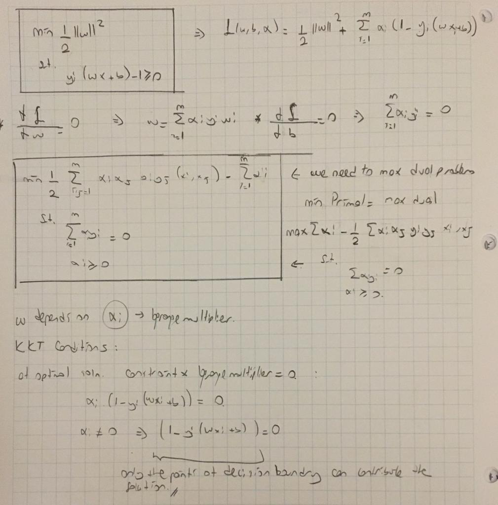
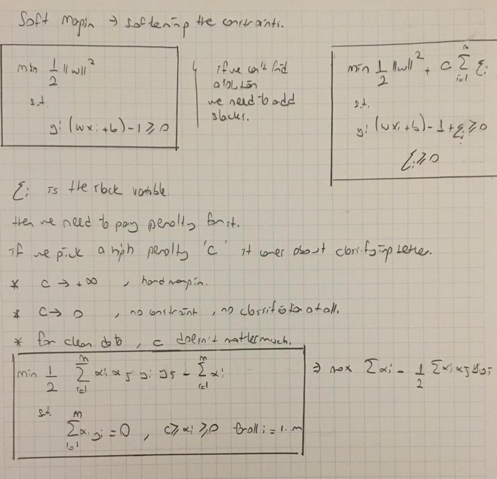
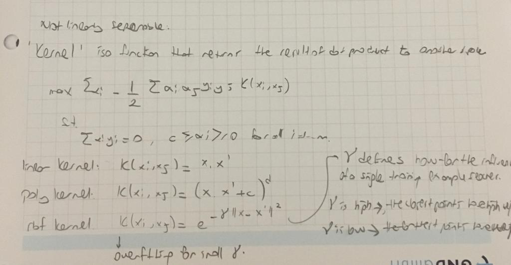

# SVM

Finding a separating line  --> a hyperplane. 

- This line maximizes the distance to the nearest point in either classes. 
- The distance is called  MARGINS. 

Aim is to do right classification subject to maximum margin. 

- SVM is robust to outliers. 

    Simple coding: 
    
    clf = svm.SVC(kernel='linear', C=1000)
    clf.fit(X, y)
    clf.predict(X)
    
    clf.decision_function(xy)
    clf.support_vectors_

Better explanation from Hands on Machine Learning with Scikit Learn & Tensorflow [Geron] book.

'SVM classifier: fitting the widest possible street (representwed by the dashed lines) between the classes. This is called large margin classification.' [Geron] 

'Adding more training instances off the street will not effect the decision boundary.
It is determined by the instances located on the edge of the street. --> Support vectors. ' [Geron]

## What is hard margin?

If we impose that all instances be off the street and on the right side --> hard margin classification. [Geron]
It is impossible to classify data if there are outliers. 

## What is the solution?

The solution is soft margin classification. 

You can use more flexible model. The objective is :

    keep the street as large as possible and limit the margin violations. 

### Margin violations?

- Instances may end up in the middle of the street or on the wrong side.

###  Use soft margin in scikit learn:

 Use the c hyperparameter. 
 
    If c is small: wider street (large margin) & more margin violations.
    If c is large: tight street (small margin) & fewer margin violations.

### Linear model examples:

models = (svm.SVC(kernel='linear', C=C),
          svm.LinearSVC(C=C, max_iter=10000),
         )
         

          
          
### Non Linear model examples with 'kernel trick'

models = (svm.SVC(kernel='rbf', gamma=0.7, C=C),
          svm.SVC(kernel='poly', degree=3, gamma='auto', C=C))

- You can use Polynomial Regression with kernel ='poly'
- Another way is using RBF --> Gaussian Radial Basis Function. 

    Increase gamma if the model underfits, decrease gamma if the model overfit. 

Another dataset classification is in [SVM_house_data](SVM_house_data)

# Source

The rest of the notes are coming from the free book written by Alexandre KOWALCZYK. 

I would like to thank him for sharing this book free, it helped me a lot during my SVM studies.

You can find the book: https://www.svm-tutorial.com/2017/10/support-vector-machines-succinctly-released/

Also you can read the articles: https://www.svm-tutorial.com/2017/02/svms-overview-support-vector-machines/

# Selecting Hyperplane

Our goal is selecting a hyperplane which gives the max distance between the plane and the closest point to it. 

## Maximize minimum distance:

The distance can be calculated as :

***&Beta; = wx +b***
  
Find the min distance:

***B = min i (&Beta;i) where i = 1..m***

Select the hyperplane which has max B:

***max j (Bj)  where j = 1...k***

***max j (min i (&Beta;i) )  where j = 1...k (hyperplanes), i = 1.. m(training points)***

## What if the point is incorrectly classified?

Multipliy &Beta; with y. If their signs are equal the multiplication gives positive results. 

The distance:

***&Beta; = wx +b***

Functional margin:

***fi = yi * &Beta;i***

Functional margin of the dataset:

***F = min i (fi) = min i (yi * &Beta;i) where i = 1..m training points***

Select the hyperplane which has max F:

***max j (Fj) where j = 1...k***

***max j (min i fi) where j = 1...k (hyperplanes), i = 1.. m(training points)***

***max j (min i(yi * &Beta;i)) where j = 1...k (hyperplanes), i = 1.. m(training points)***

## What if we have same hyperplanes?

w1 = (2,1) and w2 = (20,10) are the same hyperplanes. 

b1 = 5 and b2 = 50

x = [1,1] and y = 1

Calculate the function margin:

f1 = 1*(2*1 + 1*1 + 5)  = 8

f2 = 1*(20*1 + 10*1 + 50) = 80 
 
 
=(

They should have been equal! 

## Use unit vector:

There is a nice proof about the geometric margin in the book. 

The distance:

***&Beta; = wx +b***

Geometric margin:

***&gamma;i = yi * (w/ ||w|| * x + b / ||w||)***

Geometric margin of the dataset:

***M = min i (&gamma;i) = min i (yi * (w/ ||w|| * x + b / ||w||)) where i = 1..m training points***

Select the hyperplane which has max M:

***max j (Mj) where j = 1...k***

***max j (min i (&gamma; i)) where j = 1...k (hyperplanes), i = 1.. m(training points)***

***max j (min i(yi * &Beta;i)) where j is hyperplanes, i is training points.***

# SVM Optimization Problem

M = min i (&gamma;i)  

where &gamma;i = yi * (w/ ||w|| * x + b / ||w||).

    max (w,b) M
    s.t.
    &gamma;i >= M for i = 1..m

The constraint shows that M should be less than all the gemoetric distances which are the distances from the selected hyperplane to each point.

Let's write this optimization problem: M = F/||w||

    max (w,b) F/||w||
    s.t.
    fi /||w|| >= F/||w|| for i = 1..m

Delete the denominator:

    max (w,b) F/||w||
    s.t.
    fi  >= F for i = 1..m
    
Scale w and b so that F = 1:

    max (w,b) 1/||w||
    s.t.
    fi  >= 1 for i = 1..m
    
Objective function can be changed and write the equation of fi:

    min (w,b) ||w||
    s.t.
    yi(wx + b)  >= 1 for i = 1..m
  
  
This can be converted to:

    min (w,b) 1/2 ||w||^2
    s.t.
    yi(wx + b) -1  >= 0 for i = 1..m
    
    
    
Another Explanation is coming from Alex Smola, http://videolectures.net/mlss08au_smola_ksvm/#

There are two vectors in each side of the hyperplane. We would like to maximize the distance between them: 

- The first vector is on the positive side: w * x1 + b = 1
- The second vector is on the negative side: w * x2 + b = -1

The distance between x1 and x2 : 

- w(x1-x2) = 2 
- x1- x2 = 2 / ||w||

We would like this distance to be maximized. 

- max(w,b) 2/ ||w||
- min(w,b) 1/2 ||w||
- min(w,b) 1/2 ||w||^2   ----> this is a nice convex function, that's why we use the power of w. 

    
This is CONVEX QUADRATIC PROBLEM

You can solve it with python package: CVXOPT

I added my handwritten notes: 

Primal to dual:

Soft margin:

Kernel trick:

- Find resources: https://onionesquereality.wordpress.com/2008/08/31/demystifying-support-vector-machines-for-beginners/

- Watch this: http://videolectures.net/mlss06tw_lin_svm/

- Read about strong and weak duality!!

- Read this article: https://projecteuclid.org/download/pdfview_1/euclid.ss/1166642435

- MIT Lecture: https://www.youtube.com/watch?v=_PwhiWxHK8o