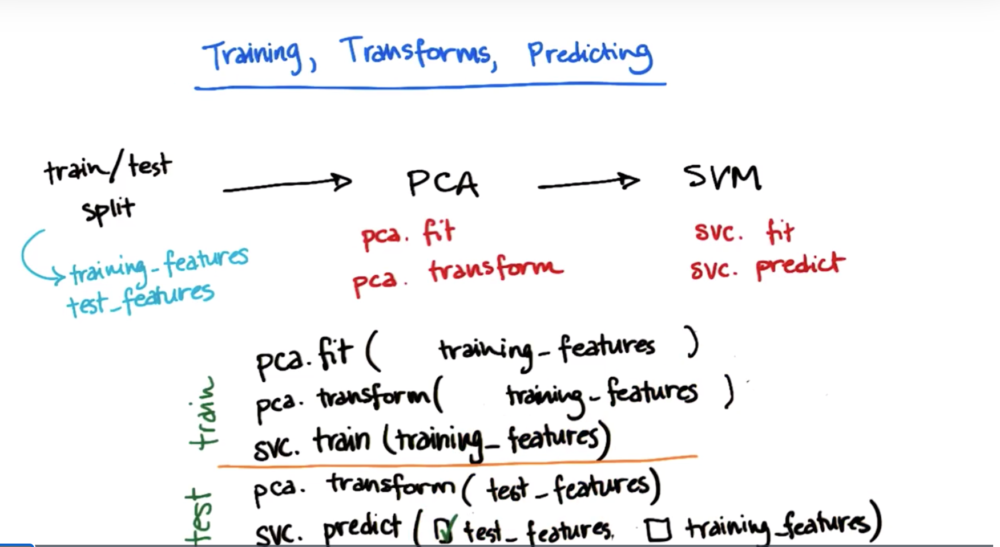

# Train test split

[Code](validation.py)

https://classroom.udacity.com/courses/ud120/lessons/2960698751/concepts/29498987540923

We want to maximize the volume of training set an test set. 

- max training set -> best learning result
- max test set -> best validation result

# Cross Validation
Ypu will use all data for testing and training :)

Split data to k fold. 

Run k seperate learning experiment:
- pick testing set
- train
- test on testing set and store the results. 

Take the average test results for k experiments.

   |   | train test split | k-fold cross validation  |
|---|---|---|
| minimize training time | + |  |  
| minimize run time |  | + | 
| maximize accuracy |  | + |

************
https://classroom.udacity.com/courses/ud120/lessons/2960698751/concepts/34257790760923

If our original data comes in some sort of sorted fashion, then we will want to first shuffle the order of the data 
points before splitting them up into folds, or otherwise randomly assign data points to each fold. If we want to do this
using KFold(), then we can add the "shuffle = True" parameter when setting up the cross-validation object.

If we have concerns about class imbalance, then we can use the StratifiedKFold() class instead. Where KFold() 
assigns points to folds without attention to output class, StratifiedKFold() assigns data points to folds so that each 
fold has approximately the same number of data points of each output class. This is most useful for when we have 
imbalanced numbers of data points in your outcome classes (e.g. one is rare compared to the others). For this class as 
well, we can use "shuffle = True" to shuffle the data points' order before splitting into folds.

************** 

# Cross Validation for Parameter Tuning

https://classroom.udacity.com/courses/ud120/lessons/2960698751/concepts/30561085470923

    from sklearn.model_selection import GridSearchCV
    
    params = dict(max_depth=list(range(1,10)), min_samples_split=list(range(10,50,10)))
    params = {'max_depth':(list(range(1,10))), 'min_samples_split': [10, 20, 30, 40, 50]}
    
    clf = DecisionTreeClassifier()
    grid = GridSearchCV(clf, params, cv=5)
    grid.fit(X, y)
    df_grid_results = pd.DataFrame(grid.cv_results_)[['mean_test_score', 'std_test_score', 'params']]
    print(df_grid_results)
    print('grid.best_score_ {}: '.format(grid.best_score_))  # grid.best_score_ 0.944:
    print('grid.best_params_ {}: '.format(grid.best_params_))  # grid.best_params_ {'max_depth': 5, 'min_samples_split': 10}:
    

# Feature Scaling

Read More: https://scikit-learn.org/stable/modules/preprocessing.html

[Code](Feature_Scaling.py)

Which algorithms would be affected by scaling? 

- Decision Trees NO!
- Linear Regression NO!  --- the coefficients are seperated they don't affected by others. 
- SVM with rbf kernel YES!   --- calculates distance to decision boundary
- k-means Clustering - YES!  --- calculates distance to mean point

- Minmax scaler : x - x.min() / x.max() - x.min()
- Standart scaler: z = (x - u) / s

Linear regression Output: 
- formula without scaling:  2.99 * X_1 +  -0.0201  * X_2 +  [4.61]
- r^2 without scaling:  0.99

When we scale X:
- formula WITH scaling:  294.35  * X_1 +  -0.033 * X_2 +  [6.19]
- r^2 WIHT scaling:  0.99

When we scale both X and y:
- formula WITH scaling:  1.0  * X_1 +  -0.0001 * X_2 +  [-0.0004]
- r^2 WIHT scaling:  0.99

SVM Regression Output: 
- r^2 without scaling:  0.49

When we scale only X: 
- r^2 WITH scaling:  0.26
- r^2 WITH std scaling:  0.99

When we scale both X and y:
- r^2 WITH scaling:  0.95
- r^2 WITH std scaling:  0.99
