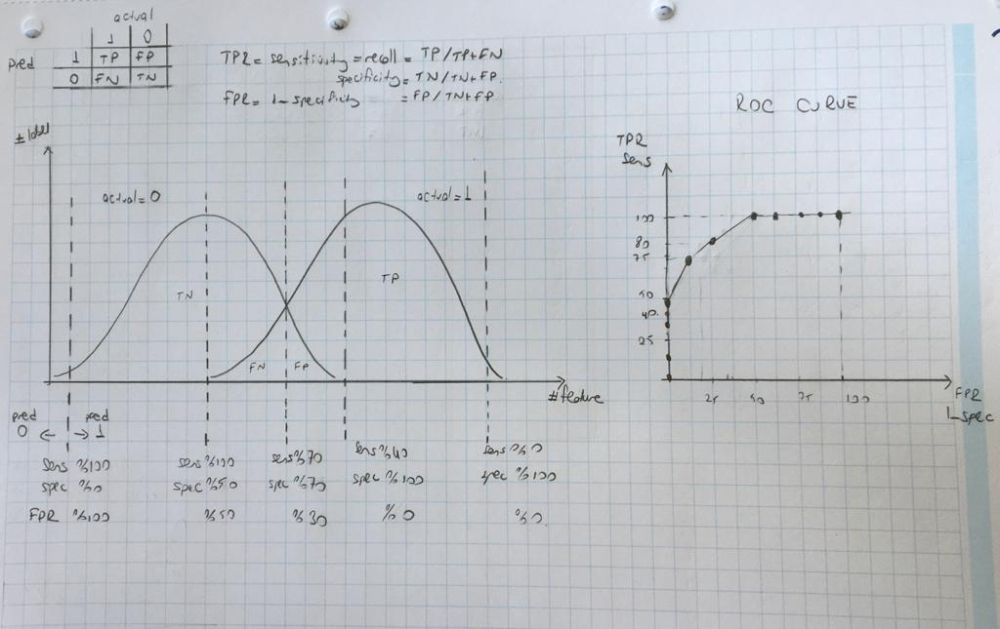

In this package I copied the scripts from the lecture: class_vis.py and prep_terran_data.py

- [class_vis.py](class_vis.py) is used for visualisation
- [prep_terrain_data.py](prep_terrain_data.py) is used for generating data. 

Evaluation is common for all types of classifiers.
Below I copied my notes from Machine Learning Crash Course by Google. You can reach rest of the notes [here](https://github.com/pelinbalci/machinelearning)

# Evaluation

Confusion Matrix:

|   | actual = 1  | actual = 0  |
|---|---|---|
| pred = 1  | TP | FP  |  
| pred = 0 | FN  | TN | 

    Python: 
    from sklearn.metrics import confusion_matrix
    confusion_matrix(labels_test, pred_test)
    
    Order of output is:
             pred 0  pred 1
    actual 0 [[ TN      FP]
    actual  1 [ FN      TP]]

Do not memorize those! 
is the pred correct (T or F) &  prediction (P (1) or N (0))

        Accuracy = TP + TN / TP + TN + FP + FN
        
        Recall = Sensitivity = TP Rate = TP / TP + FN
        
        Specificity = TN / TN + FP
        
        Precision  = TP / TP + FP

### Shortcoming of accuracy

- Not ideal for skewed classes
- We may want to check one side of guessing incorrect
- We may want to check one side of guessing correct 

       
⭐️ What is recall? 

When the outcome is 1 (positive), how many times we can catch it or recall it? 

⭐️ What is precision?

How precisely do we say positive (1) ? When we say 1, how many times we cathh the reality?

##Recall vs Precision

If I want recall be HIGH, I should say more 1(positive). 
I can do that by lower my class treshold. 

For example: if I try to detect a baby crying, every time I hear a little sound, I say 'crying!!'.

Another example: if I try to detect a tumor, every time I see a little change in cell, I say 'tumor!!'. 
My recall rate is high. If the tumor exist I can detect it in high score. But what if there is no tumor? Again I choose 
to say tumor a lot and my FP number get increase. This lead us to very low precision value. 

   |   | actual = tumor  | actual = no tumor  |
|---|---|---|
| pred = tumor  | TP = 8 | FP = 70 |  
| pred = no tumor | FN = 1  | TN = 21| 

- recall = 8 / 9  --> great :)
- precision = 8 /78 --> very bad :(
    
    
## What is the best classification treshold?

- Try a treshold value 
- Evaluate the model.

But this is not very efficient. 

⭐️ ROC curve looks at the performance of our model across all possible tresholds. 

⭐️ ROC = Receiver Operating Characteristics

⭐️ AUC = Area Under ROC Curve

ROC & AUC is the curve of TP Rate vs FP rate. 

⭐️ TP Rate = Recall = Sensitivity = TP / TP + FN  --> actual is positive

⭐️ FP Rate = 1- Specificity =  FP / FP + TN ---> actual is negative

## ROC Examples:

1. This ROC curve has an AUC between 0 and 0.5.  The corresponding model actually performs worse than random guessing! 
2. This is the worst possible ROC curve; it ranks all negatives above all positives, and has an AUC of 0.0.  
If you were to reverse every prediction (flip negatives to positives and postives to negatives), 
you'd actually have a perfect classifier!

3. This is the best possible ROC curve, as it ranks all positives above all negatives. It has an AUC of 1.0. 
(You should be suspicious about this. you may have overfit to your training data, or the label data may be replicated 
in one of your features. )
4. This ROC curve has an AUC of 0.5. its predictive ability is no better than random guessing.
5. This ROC curve has an AUC between 0.5 and 1.0, meaning it ranks a random positive example higher than a random 
negative example more than 50% of the time. Real-world binary classification AUC values generally fall into this range.

